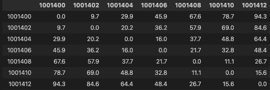
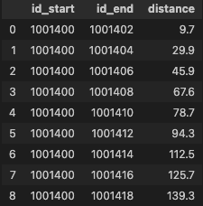
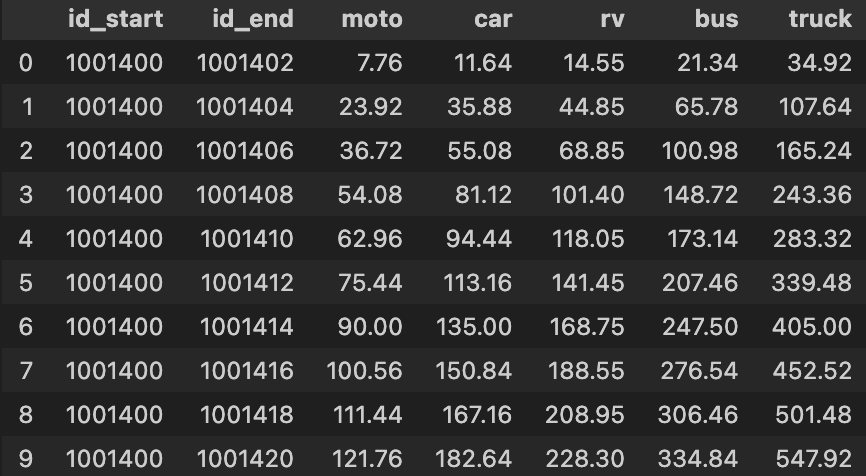

# MapUp - Python Assessment

## Overview

This assessment is designed to evaluate your proficiency in Python programming, data manipulation, and analysis, as well as your ability to work with Excel. Below, you'll find details on each component of the assessment and the tasks you should complete. Best of luck!


## Important Points to Note:
- The assessment will be tested using our internal set of test cases. Scripts must be developed in accordance with the template shared. Please use the following template to create your scripts:
    - 📂 templates
        - 📄 python_section_1.py
        - 📄 python_section_2.py
- We've clearly outlined the interfaces of our functions, specifying the input and output data types with distinct signatures.
- Any deviation especially in naming conventions and providing arguments will impact the correct assessment of your work


## Result Submission:
- Data that you need to work with is in the folder `datasets`.
- Clone the provided GitHub repository.
- There should be a folder named `submissions` in the root of your cloned repository, where you need to place the solution files (python_section_1.py, python_section_2.py, excel_assessment.xlsm). This folder should contain the following:
  - 📂 your_cloned_repo
      - 📂 submissions
        - 📄 python_section_1.py
        - 📄 python_section_2.py
        - 📄 excel_assessment.xlsm
      - 📂 templates
      - 📂 datasets
- Add the following members as **collaborators** to your repository.
    - `varuna@mapup.ai`
    - `nitinsk@mapup.ai`
    - `parshuca@mapup.ai`
- Submit the link to your repository via the provided Google Form for evaluation.


## MapUp - Excel Assessment

You have to submit an excel assessment (as an .xlsm file) along with your python task. This evaluation tests your proficiency in Conditional Formatting, Excel Formulae, and Data Manipulation
<br /><br /> 
# Python Section 1

## Question 1: Reverse List by N Elements

**Problem Statement**:

Write a function that takes a list and an integer `n`, and returns the list with every group of `n` elements reversed. If there are fewer than `n` elements left at the end, reverse all of them.

**Requirements**:
1. You must not use any built-in slicing or reverse functions to directly reverse the sublists.
2. The result should reverse the elements in groups of size `n`.

**Example**:
- **Input**: `[1, 2, 3, 4, 5, 6, 7, 8]`, `n=3`
  - **Output**: `[3, 2, 1, 6, 5, 4, 8, 7]`

- **Input**: `[1, 2, 3, 4, 5]`, `n=2`
  - **Output**: `[2, 1, 4, 3, 5]`

- **Input**: `[10, 20, 30, 40, 50, 60, 70]`, `n=4`
  - **Output**: `[40, 30, 20, 10, 70, 60, 50]`


## Question 2: Lists & Dictionaries

**Problem Statement**:

Write a function that takes a list of strings and groups them by their length. The result should be a dictionary where:
- The keys are the string lengths.
- The values are lists of strings that have the same length as the key.

**Requirements**:
1. Each string should appear in the list corresponding to its length.
2. The result should be sorted by the lengths (keys) in ascending order.

**Example**:
- **Input**: `["apple", "bat", "car", "elephant", "dog", "bear"]`
  - **Output**: `{3: ['bat', 'car', 'dog'], 4: ['bear'], 5: ['apple'], 8: ['elephant']}`

- **Input**: `["one", "two", "three", "four"]`
  - **Output**: `{3: ['one', 'two'], 4: ['four'], 5: ['three']}`


## Question 3: Flatten a Nested Dictionary

You are given a nested dictionary that contains various details (including lists and sub-dictionaries). Your task is to write a Python function that flattens the dictionary such that:

- **Nested keys** are concatenated into a single key with levels separated by a dot (`.`).
- **List elements** should be referenced by their index, enclosed in square brackets (e.g., `sections[0]`).
  
For example, if a key points to a list, the index of the list element should be appended to the key string, followed by a dot to handle further nested dictionaries.

**Requirements**:

1. **Nested Dictionary**: Flatten nested dictionaries into a single level, concatenating keys.
2. **Handling Lists**: Flatten lists by using the index as part of the key.
3. **Key Separator**: Use a dot (`.`) as a separator between nested key levels.
4. **Empty Input**: The function should handle empty dictionaries gracefully.
5. **Nested Depth**: You can assume the dictionary has a maximum of 4 levels of nesting.

**Example**:

**Input**:

```json
{
    "road": {
        "name": "Highway 1",
        "length": 350,
        "sections": [
            {
                "id": 1,
                "condition": {
                    "pavement": "good",
                    "traffic": "moderate"
                }
            }
        ]
    }
}
```
**Output**:
```json
{
    "road.name": "Highway 1",
    "road.length": 350,
    "road.sections[0].id": 1,
    "road.sections[0].condition.pavement": "good",
    "road.sections[0].condition.traffic": "moderate"
}
```

## Question 4: Generate Unique Permutations

**Problem Statement**:

You are given a list of integers that may contain duplicates. Your task is to generate all **unique** permutations of the list. The output should not contain any duplicate permutations.

**Example**:

**Input**:
```json
[1, 1, 2]
```

**Output**:
```json
[
    [1, 1, 2],
    [1, 2, 1],
    [2, 1, 1]
]
```

## Question 5: Find All Dates in a Text

**Problem Statement**:

You are given a string that contains dates in various formats (such as "dd-mm-yyyy", "mm/dd/yyyy", "yyyy.mm.dd", etc.). Your task is to identify and return all the valid dates present in the string.

You need to write a function `find_all_dates` that takes a string as input and returns a list of valid dates found in the text. The dates can be in any of the following formats:
- `dd-mm-yyyy`
- `mm/dd/yyyy`
- `yyyy.mm.dd`

You are required to use **regular expressions** to identify these dates.

**Example**:

**Input**:
```json
text = "I was born on 23-08-1994, my friend on 08/23/1994, and another one on 1994.08.23."
```
**Output**:
```json
["23-08-1994", "08/23/1994", "1994.08.23"]
```

## Question 6: Decode Polyline, Convert to DataFrame with Distances

You are given a polyline string, which encodes a series of latitude and longitude coordinates. Polyline encoding is a method to efficiently store latitude and longitude data using fewer bytes. The Python `polyline` module allows you to decode this string into a list of coordinates.

Write a function that performs the following operations:
1. **Decode the polyline** string using the `polyline` module into a list of (latitude, longitude) coordinates.
2. **Convert these coordinates into a Pandas DataFrame** with the following columns:
   - `latitude`: Latitude of the coordinate.
   - `longitude`: Longitude of the coordinate.
   - `distance`: The distance (in meters) between the current row's coordinate and the previous row's one. The first row will have a distance of `0` since there is no previous point.
3. **Calculate the distance** using the Haversine formula for points in successive rows.

## Question 7: Matrix Rotation and Transformation

Write a function that performs the following operations on a square matrix (n x n):

1. **Rotate the matrix by 90 degrees clockwise.**
2. **After rotation, for each element in the rotated matrix, replace it with the sum of all elements in the same row and column (in the rotated matrix), excluding itself.**

The function should return the transformed matrix.

### Example

For the input matrix:
```
matrix = [[1, 2, 3],[4, 5, 6],[7, 8, 9]]
```

Rotate the matrix by 90 degrees clockwise:
```
rotated_matrix = [[7, 4, 1],[8, 5, 2],[9, 6, 3]]
```

Replace each element with the sum of all elements in the same row and column, excluding itself:
```
final_matrix = [[22, 19, 16],[23, 20, 17],[24, 21, 18]]
```

## Question 8: Time Check

You are given a dataset, `dataset-1.csv`, containing columns `id`, `id_2`, and timestamp (`startDay`, `startTime`, `endDay`, `endTime`). The goal is to verify the completeness of the time data by checking whether the timestamps for each unique (`id`, `id_2`) pair cover a full 24-hour period (from 12:00:00 AM to 11:59:59 PM) and span all 7 days of the week (from Monday to Sunday).

Create a function that accepts `dataset-1.csv` as a DataFrame and returns a boolean series that indicates if each (`id`, `id_2`) pair has incorrect timestamps. The boolean series must have multi-index (`id`, `id_2`).
<br /><br /> 
# Python Section 2

***(Questions in this section are interrelated, so please solve them accordingly.)***
## Question 9: Distance Matrix Calculation

Create a function named `calculate_distance_matrix` that takes the `dataset-2.csv` as input and generates a DataFrame representing distances between IDs. 

The resulting DataFrame should have cumulative distances along known routes, with diagonal values set to 0. If distances between toll locations A to B and B to C are known, then the distance from A to C should be the sum of these distances. Ensure the matrix is symmetric, accounting for bidirectional distances between toll locations (i.e. A to B is equal to B to A). 

Sample result dataframe:\
 

## Question 10: Unroll Distance Matrix

Create a function `unroll_distance_matrix` that takes the DataFrame created in Question 9. The resulting DataFrame should have three columns: columns `id_start`, `id_end`, and `distance`.

All the combinations except for same `id_start` to `id_end` must be present in the rows with their distance values from the input DataFrame.

Sample result dataframe:\
 

## Question 11: Finding IDs within Percentage Threshold

Create a function `find_ids_within_ten_percentage_threshold` that takes the DataFrame created in Question 10 and a reference value from the `id_start` column as an integer.

Calculate average distance for the reference value given as an input and return a sorted list of values from `id_start` column which lie within 10% (including ceiling and floor) of the reference value's average.

## Question 12: Calculate Toll Rate

Create a function `calculate_toll_rate` that takes the DataFrame created in Question 10 as input and calculates toll rates based on vehicle types. 

The resulting DataFrame should add 5 columns to the input DataFrame: `moto`, `car`, `rv`, `bus`, and `truck` with their respective rate coefficients. The toll rates should be calculated by multiplying the distance with the given rate coefficients for each vehicle type: 
- 0.8 for `moto`
- 1.2 for `car`
- 1.5 for `rv`
- 2.2 for `bus`
- 3.6 for `truck`

Sample result dataframe:\
 

## Question 13: Calculate Time-Based Toll Rates

Create a function named `calculate_time_based_toll_rates` that takes the DataFrame created in Question 12 as input and calculates toll rates for different time intervals within a day. 

The resulting DataFrame should have these five columns added to the input: start_day, start_time, end_day, and end_time.
- `start_day`, `end_day` must be strings with day values (from Monday to Sunday in proper case)
- `start_time` and `end_time` must be of type datetime.time() with the values from time range given below.

Modify the values of vehicle columns according to the following time ranges:

**Weekdays (Monday - Friday):**
- From 00:00:00 to 10:00:00: Apply a discount factor of 0.8
- From 10:00:00 to 18:00:00: Apply a discount factor of 1.2
- From 18:00:00 to 23:59:59: Apply a discount factor of 0.8

**Weekends (Saturday and Sunday):**
- Apply a constant discount factor of 0.7 for all times.

For each unique (`id_start`, `id_end`) pair, cover a full 24-hour period (from 12:00:00 AM to 11:59:59 PM) and span all 7 days of the week (from Monday to Sunday).

Sample result dataframe:\
 
"# MapUp-DA-Assessment-2024-mainArun" 
